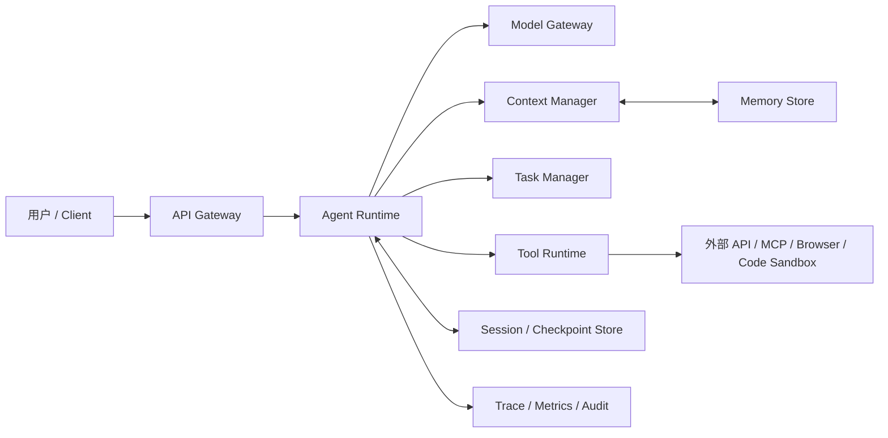
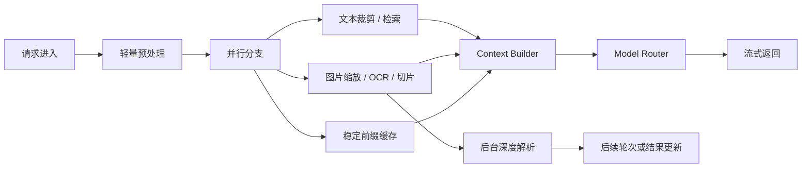
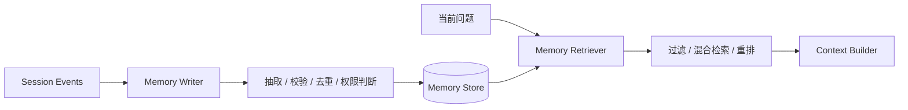
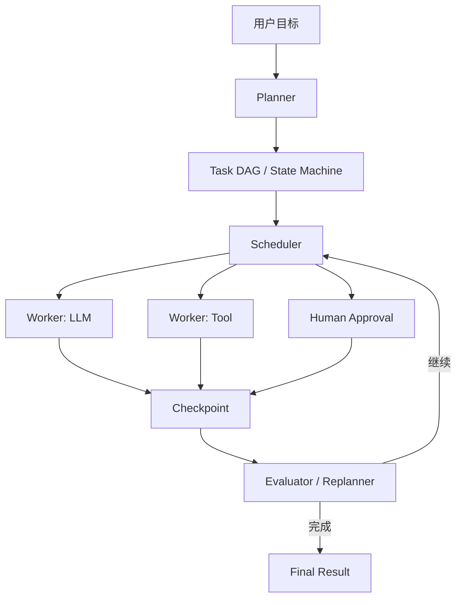
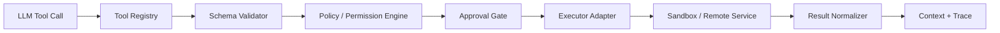
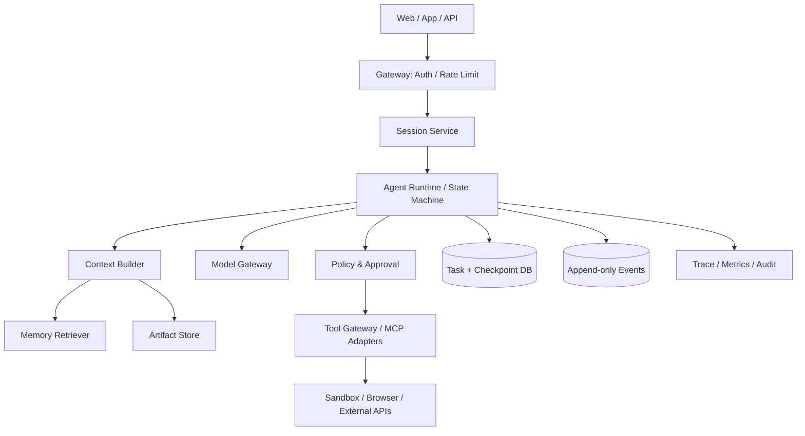

# Agent 架构设计面试八股答案

> 适用场景：Agent 平台、LLM 应用、AI 基础设施、智能体后端等岗位的架构设计面试。  
> 推荐答题顺序：**先定义问题 → 给核心架构 → 讲关键链路 → 说明取舍与失败处理 → 用指标收尾**。

---

## 0. 总体心智模型

一个可落地的 Agent 系统，不只是“LLM + 若干工具”，而是由六个核心部分组成：



- **Agent Runtime**：驱动“模型决策—工具执行—结果回填—继续决策”的主循环。
- **Context Manager**：在 token 预算内组装本轮模型真正需要看到的信息。
- **Memory**：跨轮次或跨会话保存可复用信息，不等于把全部历史原样塞回上下文。
- **Task Manager**：管理长任务的拆分、依赖、状态、重试、暂停和恢复。
- **Tool Runtime**：负责工具发现、参数校验、权限控制、执行隔离与结果标准化。
- **Session Runtime**：隔离不同会话的历史、状态、资源和并发写入。

### 面试中的通用指标

不要只说“更快、更准、更稳定”，应落到指标：

| 维度 | 常用指标 |
| --- | --- |
| 延迟 | TTFT、端到端耗时、工具调用耗时，P50/P95/P99 |
| 生成 | TPOT（每输出 token 时间）、吞吐量、并发数 |
| 质量 | 任务成功率、工具选择准确率、参数正确率、事实一致性 |
| Memory | 召回率、精确率、过期记忆命中率、冲突率 |
| 稳定性 | 超时率、重试率、循环超限率、恢复成功率 |
| 成本 | 单任务 token、模型成本、工具/API 成本、存储成本 |
| 安全 | 越权拦截率、敏感信息泄漏、危险操作人工确认覆盖率 |

---

# 一、Context / Performance

## 1. 长窗口或多模态首轮输入导致首 token 需要 5–10 秒，如何低成本压到约 2 秒？

### 1.1 概念解释

首 token 延迟通常用 **TTFT（Time To First Token）** 衡量，主要由以下部分组成：

1. 请求排队和网络传输；
2. 文本分词、图片/PDF/OCR 等预处理；
3. 检索、重排和上下文组装；
4. 模型对整个输入执行 prefill 并建立 KV Cache；
5. 生成并传输第一个 token。

长文本会增加 prefill 计算，多张高分辨率图片还会增加编码和上传成本。因此先用 Trace 分解延迟，不能把所有时间都归因于模型。

### 1.2 架构设计



### 1.3 技术方案

**第一步：测量并制定延迟预算。**

- 为网关、预处理、检索、模型排队、prefill 和首 token 传输分别打 span。
- 目标应写成“正常负载下 P95 TTFT ≤ 2 秒”，并说明输入上限；无限长输入无法承诺固定延迟。
- 例如将 2 秒拆为：预处理 200 ms、检索与组装 200 ms、排队与 prefill 1.3 s、网络及余量 300 ms。

**第二步：减少真正送入模型的内容。**

- 先去重、去模板噪声、删除无关历史，只召回与当前问题相关的片段。
- 工具列表按需加载，不在每轮注入所有工具的大段 Schema。
- PDF 先按目录、页码和段落索引，问题只命中相关页，而不是整份文档入模。
- 对图片进行尺寸约束、缩略图筛选和区域裁剪；只有确实需要时才发送原图。

**第三步：利用稳定前缀缓存。**

- system prompt、组织规则、常用工具 Schema 等稳定前缀尽量保持字节级一致，以提高服务端 prompt/prefix cache 命中率。
- 会话内复用 KV Cache 适合前缀不变的连续请求；跨请求能否复用取决于模型服务能力。
- 缓存只减少重复 prefill，不能替代上下文裁剪，也不能假设所有供应商都支持。

**第四步：并行和延迟加载。**

- 文本检索、图片预处理、权限检查可以并行执行。
- 先处理用户当前提问必要的信息，完整 OCR、全库索引、高清图片分析放到后台。
- 流式传输降低感知等待，但它只能改善用户体验，真正的 TTFT 仍需靠前述优化下降。

**第五步：模型路由。**

- 分类、查询改写、摘要等简单步骤使用小模型或本地模型。
- 主回答按任务复杂度路由；如果必须用大模型，优先减少输入，而不是用多个串行小模型增加关键路径。
- 对高频问题使用语义缓存，但必须带用户、权限、数据版本等隔离条件。

### 1.4 优缺点

| 方案 | 优点 | 风险 / 缺点 |
| --- | --- | --- |
| 上下文裁剪与检索 | 直接降低 prefill 和成本 | 可能误删关键约束，需要召回评测 |
| Prompt / Prefix Cache | 对稳定前缀收益大，改造小 | 依赖服务商；前缀轻微变化也可能失效 |
| 多模态降采样 | 显著减少视觉 token 和上传时间 | 小字、图表细节可能丢失 |
| 并行与后台解析 | 缩短关键路径 | 系统状态更复杂，需要处理迟到结果 |
| 小模型路由 | 成本低、速度快 | 路由错误会伤害质量 |

### 1.5 面试回答版本

> 我不会直接承诺所有长输入都能在 2 秒内返回，而是先把目标定义为给定输入上限和正常负载下的 P95 TTFT。然后用 Trace 将时间拆成预处理、检索、排队、prefill 和网络。优化上，第一是减少入模 token，只保留相关历史和命中文档片段；第二是让 system prompt 和工具 Schema 保持稳定，利用 prefix cache；第三是并行执行检索、权限检查和图片预处理，并将完整 OCR、索引等重任务延迟到后台；第四是对图片做自适应缩放、裁剪，对简单步骤使用小模型。流式输出只能改善感知延迟，真正把 5–10 秒压到 2 秒，核心仍是缩短关键路径和降低 prefill。最后以 P95 TTFT、任务成功率和单请求成本共同验收，避免只换来速度却损失质量。

---

## 2. 一个 Session 连续聊了 200 轮，Context 爆了，如何压缩并保证对话流畅？

### 2.1 概念解释

上下文压缩不是简单删除旧消息，而是在有限 token 内同时保留：

- 当前目标与未完成任务；
- 用户明确约束、偏好和关键事实；
- 最近几轮原文；
- 仍被引用的工具结果和产物；
- 更早历史的结构化摘要。

原始消息应保存在外部存储中，压缩只改变“本轮送给模型的视图”，不应不可逆地删除审计记录。

### 2.2 架构设计

```text
Active Context =
  System / Policy（原文）
  + Pinned State（目标、约束、未决事项）
  + Hierarchical Summary（较早历史摘要）
  + Retrieved Episodes（按当前问题召回的旧片段）
  + Recent Window（最近若干轮原文）
  + Current User Input
  + Reserved Output Budget
```

底层保存三份数据：

1. **Append-only Event Log**：完整原始消息与工具事件；
2. **Session State**：目标、约束、计划、未决事项、产物引用；
3. **Summary Versions**：可追溯、可重新生成的分层摘要。

### 2.3 技术方案

- 当 token 使用达到窗口的 70%–80% 时后台增量摘要，不等溢出后同步处理。
- 保留最近 N 轮原文；旧消息先按小段摘要，再合并成阶段摘要，形成层级式 summary。
- 用户硬约束、系统规则、审批状态不进入有损摘要区，而是保留在 typed state 中。
- 大型工具结果只保留结构化摘要、校验值和 artifact ID；需要细节时再按引用读取。
- 当前问题到来时，用关键词/向量/元数据过滤召回相关旧片段，与摘要一起组装。
- 摘要采用固定 Schema，例如：`goal`、`decisions`、`constraints`、`facts`、`open_items`、`artifacts`、`failed_attempts`。
- 每次压缩记录来源消息范围和版本号；出现事实冲突时优先读取原始事件而不是继续“摘要的摘要”。
- 用回归集验证压缩前后对关键追问的答案一致性，例如人名、数字、用户否定项和工具结果。

### 2.4 优缺点

| 策略 | 优点 | 缺点 |
| --- | --- | --- |
| 滑动窗口 | 简单、稳定 | 很早但关键的信息会丢失 |
| 滚动摘要 | 压缩比高 | 摘要误差会累积 |
| 检索式召回 | 能找回远期细节 | 依赖召回质量，增加延迟 |
| 结构化状态 | 约束和任务状态稳定 | 需要定义 Schema 和更新规则 |
| 分层摘要 + 近期原文 + 检索 | 综合效果最好 | 工程复杂度较高 |

### 2.5 面试回答版本

> 我会把完整历史保存在 append-only 日志中，模型上下文只维护一个动态视图。这个视图由 system policy、结构化的目标和约束、旧历史的分层摘要、按当前问题召回的片段、最近若干轮原文组成。达到 70%–80% token 阈值时做后台增量压缩，大型工具结果改存 artifact，只在上下文放摘要和引用。用户硬约束、未完成任务和审批状态放在 typed session state 中，不做有损摘要。压缩结果带版本和原始消息范围，冲突时可以回查原文。最后用关键事实追问、工具结果追问和否定约束等回归测试，验证压缩后仍能自然衔接，而不只是看 token 变少。

---

## 3. Context Manager 应如何分配 token 预算？

### 3.1 概念解释

Context Window 是输入和输出共享的有限资源。Context Manager 的任务不是“尽量塞满”，而是选择对当前决策边际价值最高的信息，并为回答和工具循环保留空间。

### 3.2 架构设计

按优先级分层：

1. **不可裁剪**：系统策略、安全规则、当前用户输入；
2. **高优先级**：用户约束、当前任务状态、最近工具错误；
3. **可检索**：长期记忆、旧消息、文档片段；
4. **可降级**：示例、重复描述、低相关工具说明；
5. **输出保留**：预留回答与后续工具回填 token。

### 3.3 技术方案

- 先确定模型窗口和最大输出，再计算可用输入预算。
- 按 `相关性 × 重要性 × 新鲜度 × 可信度 / token 成本` 对候选片段评分。
- system prompt、用户原始问题和安全规则使用硬预算；历史、Memory、工具说明使用软预算。
- 工具采用动态发现，只注入可能使用的工具 Schema。
- 对最终上下文记录“为什么入选/被裁剪”，便于分析召回错误。
- 当预算仍不足时，优先换摘要或 artifact 引用，最后才拒绝并要求用户缩小范围。

### 3.4 优缺点

- 固定比例容易实现，但不同任务适配差。
- 动态评分利用率更高，但需要离线评测和在线监控。
- 动态工具加载节省 token，但首次发现工具可能增加一次交互。

### 3.5 面试回答版本

> 我会先从窗口中扣除最大输出和工具循环余量，再按不可裁剪、高优先级、可检索、可降级四层装配输入。候选内容按相关性、重要性、新鲜度、可信度和 token 成本综合评分。安全规则、当前问题和硬约束走硬预算，历史与 Memory 走软预算；工具 Schema 按需加载。预算不足时先将旧历史替换成摘要，再把大结果替换为 artifact 引用，最后才让用户缩小任务。这样 Context Manager 是一个可度量的选择器，而不是简单截断器。

---

## 4. Prompt Cache、KV Cache、语义缓存有什么区别？

### 4.1 概念解释与对比

| 类型 | 缓存对象 | 命中条件 | 主要收益 | 主要风险 |
| --- | --- | --- | --- | --- |
| KV Cache | 某次推理前缀的注意力中间状态 | token 前缀一致，通常会话内 | 减少重复 prefill | 占显存；失效与调度复杂 |
| Prompt / Prefix Cache | 服务侧可复用的稳定 prompt 前缀计算 | 前缀稳定且服务支持 | 降低延迟和输入成本 | 供应商相关；命中不可完全控制 |
| 结果缓存 | 相同确定性请求的最终结果 | 请求键、权限和数据版本一致 | 几乎不调用模型 | 容易返回过期或越权结果 |
| 语义缓存 | 与历史问题语义相似的答案 | 相似度达到阈值且上下文兼容 | 高频问答收益高 | “相似但不相同”会答错 |

### 4.2 技术方案

- 缓存键必须包含模型版本、prompt 版本、租户/用户权限、数据版本和关键参数。
- 私有数据默认不跨用户共享；敏感结果设置短 TTL 或不缓存。
- 写操作、实时数据查询、个性化决策通常不使用结果缓存。
- 对命中率、错误命中率、节省 token 和延迟分别监控。

### 4.3 面试回答版本

> KV Cache 和 Prefix Cache 都在减少重复 prefill，前者更接近一次推理会话的中间状态，后者通常是模型服务暴露的跨请求前缀复用能力；结果缓存直接复用完整答案；语义缓存允许近似问题命中。越靠后收益越大，但错误复用风险也越高。因此缓存键必须纳入模型、prompt、权限和数据版本，私有内容不能跨用户命中，实时查询和写操作不应直接复用结果。

---

# 二、Memory

## 5. Agent 的 Memory 分哪几类？Memory 和 Context 有什么区别？

### 5.1 概念解释

常见划分：

- **Working / Session Memory**：当前任务目标、临时变量、最近对话；生命周期通常是一个 Session。
- **Episodic Memory**：过去发生过的事件，如“上次部署失败是因为权限不足”。
- **Semantic Memory**：稳定事实与偏好，如用户技术栈、项目术语、组织知识。
- **Procedural Memory**：完成任务的方法、规则或 Skill，例如代码评审清单。

Memory 是可持久化、可检索的数据；Context 是某一轮真正发送给模型的有限输入。Memory 需要经过召回和筛选后才能进入 Context。

### 5.2 架构设计



### 5.3 技术方案

- 原始会话事件与提炼后的 Memory 分开存储。
- Memory 记录至少包含：主体、类型、内容、来源、置信度、时间、TTL、作用域、版本。
- 稳定事实可以写语义存储；临时任务状态放 Session Store；大文件放 Artifact Store。
- Procedural Memory 更适合做版本化 Skill/Policy，而不是从普通聊天中随意自动学习。

### 5.4 优缺点

- 分类后召回更可控，但数据模型更复杂。
- 全部历史都做向量化实现简单，却容易把临时内容误当永久事实。
- 自动写 Memory 体验顺滑，但错误记忆和隐私风险更高。

### 5.5 面试回答版本

> 我会区分 Session 工作记忆、事件记忆、语义事实和程序性规则。Memory 是外部可持久化信息，Context 是当前轮送入模型的有限视图，两者不能混为一谈。会话事件先进入原始日志，再由 Memory Writer 做抽取、校验、去重和作用域判断；请求到来时，Retriever 根据用户、Session、时间、相关性和权限召回，重排后才交给 Context Builder。这样既避免每轮携带完整历史，也能控制错误记忆和跨用户泄漏。

---

## 6. 什么时候写入 Memory，什么时候召回？

### 6.1 概念解释

如果每句话都写入，会产生噪声、冲突和隐私问题；如果完全依赖用户手工保存，体验又差。因此需要明确的写入策略和召回策略。

### 6.2 架构设计

**写入链路：**候选发现 → 类型判断 → 敏感性检查 → 去重/冲突检测 → 用户确认（必要时）→ 持久化。  
**召回链路：**作用域过滤 → 关键词/向量混合检索 → 时间与可信度衰减 → 重排 → token 预算裁剪。

### 6.3 技术方案

适合写入：

- 用户明确说“请记住”；
- 多次重复且长期稳定的偏好；
- 对后续任务有价值的明确决策；
- 经工具验证的稳定事实；
- 长任务的阶段性结果和未完成项。

不适合自动写入：

- 密码、Token、身份证号等敏感凭据；
- 一次性闲聊、推测、模型自行生成但未验证的信息；
- 极易过期的实时状态，除非带 TTL 和数据源；
- 具有重大后果但未经用户确认的偏好或授权。

召回时先做租户、用户、项目、Session 等硬过滤，再做混合检索和重排；返回时附来源和时间，允许模型判断是否过期。

### 6.4 优缺点

- 自动写入方便，但需要高精度抽取与撤销能力。
- 人工确认更可靠，但打断交互。
- 只用向量相似度覆盖广，但对精确实体、时间和否定条件较弱。
- 混合检索效果更稳定，但成本和复杂度更高。

### 6.5 面试回答版本

> Memory 不能每轮全量写。我会把明确的长期偏好、稳定事实、重要决策和未完成任务作为候选，经敏感性检查、去重、冲突检测后写入；涉及隐私、授权或高影响偏好时要求用户确认。召回时先按租户、用户、项目和 Session 做硬隔离，再结合关键词和向量检索，用时间、置信度和来源重排，最后受 token 预算约束。实时数据必须带 TTL，模型推测不应直接成为长期事实。

---

## 7. Memory 出现过期、错误或冲突怎么办？

### 7.1 概念解释

Memory 是带来源、时间和置信度的数据，不应被当作永远正确的事实。冲突处理的关键是可追溯、可更新、可撤销，而不是让模型临场猜测。

### 7.2 架构设计

- Memory 使用版本化记录，不直接覆盖旧值；
- 每条记忆带 `source_event_id`、`created_at`、`valid_from/to`、`confidence`；
- 构建当前视图时按可信来源、新鲜度和用户显式声明决定优先级；
- 高风险冲突进入人工确认或向用户澄清。

### 7.3 技术方案

- 用户最新明确声明通常覆盖旧偏好，但保留历史版本。
- 工具/权威系统返回的事实优先于模型推断。
- 到期数据不删除审计记录，只从默认召回集中失效。
- 提供“查看、修改、忘记我的记忆”能力。
- 监控被用户纠正的记忆比例，将其作为写入策略精度指标。

### 7.4 优缺点

- 版本化与来源追踪可靠，但增加存储和查询复杂度。
- 自动裁决交互快，但高风险事实容易误判。
- 总是询问用户安全，却会造成确认疲劳。

### 7.5 面试回答版本

> 我不会把 Memory 设计成一个可直接覆盖的字符串表，而是做成带来源、时间、置信度和有效期的版本化事实。用户最新的明确声明、权威工具结果和模型推断具有不同优先级；低风险冲突可自动选择当前版本，高风险冲突则向用户确认。过期记录从默认召回中失效但保留审计，用户应能查看、修改和删除自己的 Memory。系统还要监控记忆被纠正的比例，用来反向调整写入阈值。

---

## 8. Memory 存储如何选型？

### 8.1 架构设计与技术方案

| 数据 | 推荐存储 | 原因 |
| --- | --- | --- |
| Session 元数据、任务状态、结构化记忆 | PostgreSQL 等关系库 | 事务、约束、查询和审计能力强 |
| 短期热状态、锁、限流 | Redis | 低延迟、TTL、原子操作 |
| 语义检索向量 | pgvector 或独立向量库 | 支持近似语义召回 |
| 原始事件日志 | 数据库或日志流 + 对象存储 | 可追溯、便于重放 |
| 大型工具结果、文件、截图 | 对象存储 | 成本低，适合 artifact 引用 |

早期系统可使用 PostgreSQL + pgvector 减少组件数量；只有数据规模、检索吞吐或多模态索引达到瓶颈时再拆独立向量数据库。

### 8.2 优缺点

- 单库方案一致性与运维简单，但极大规模下检索吞吐有限。
- 专用向量库扩展性更强，但带来双写、一致性、备份和成本问题。
- Redis 适合缓存与临时状态，不应成为唯一事实来源。

### 8.3 面试回答版本

> 我会按数据特性选存储，而不是所有东西都进向量库。Session、任务状态和结构化 Memory 放关系库，Redis 只承载热状态、TTL 和锁，大文件与截图进对象存储，语义检索早期可直接用 PostgreSQL 加 pgvector。这样 MVP 组件少、事务清晰；等向量规模和吞吐真的成为瓶颈，再拆专用向量库，并处理好双写与版本一致性。

---

# 三、Task

## 9. 一个复杂任务如何拆解、调度和跟踪？

### 9.1 概念解释

Task 不等于一条 prompt。长任务通常包含多个有依赖的步骤，可能跨越多次模型调用、工具调用甚至人工审批，因此需要显式状态和可恢复执行。

### 9.2 架构设计



任务状态至少包括：`PENDING`、`RUNNING`、`WAITING_TOOL`、`WAITING_HUMAN`、`SUCCEEDED`、`FAILED`、`CANCELLED`。

### 9.3 技术方案

- 简单任务直接执行，只有复杂任务才调用 Planner，避免额外延迟。
- 计划表示为有依赖关系的 DAG 或显式状态机，而不是一段无法校验的自然语言。
- 每个节点定义输入、输出、依赖、超时、重试策略、幂等键和完成条件。
- 每步后写 checkpoint；进程重启时从最后一个已确认状态恢复。
- 执行结果偏离预期时局部重规划，限制最大重规划次数，防止无限循环。
- 并行执行无依赖节点；共享资源设并发上限和背压。

### 9.4 优缺点

- 先规划后执行适合长任务，但计划可能基于不完整信息且增加 token 成本。
- DAG 易并行和观察，但动态分支表达不如状态机自然。
- 状态机可靠、可恢复，但状态数量可能膨胀。

### 9.5 面试回答版本

> 我会先按复杂度路由，简单请求直接进入工具调用循环，复杂请求才生成结构化计划。计划落成 DAG 或状态机，每个节点有明确输入输出、依赖、超时、重试、幂等键和完成条件。Scheduler 并行执行无依赖节点，每步写 checkpoint；失败后从最近成功点恢复，而不是重跑整个任务。执行结果与计划不一致时允许局部重规划，但设置最大次数和预算。这样任务是可观察、可暂停、可恢复的，而不是把一段计划文本交给模型自由发挥。

---

## 10. 如何处理任务重试、重复执行和副作用？

### 10.1 概念解释

网络超时不代表操作没有成功。如果对“创建订单、发送邮件、删除文件”等写操作盲目重试，可能产生重复副作用。因此重试必须与幂等、状态查询和补偿机制一起设计。

### 10.2 架构设计与技术方案

- 读取类工具可对瞬时错误执行指数退避 + 抖动重试。
- 写操作携带 `idempotency_key = task_id + step_id + operation_version`。
- 工具端支持幂等时直接复用结果；不支持时先查询状态，再决定是否重试。
- 将“请求已发送”和“结果已确认”分成两个状态，避免超时后误判失败。
- 跨系统事务使用 Saga：已完成步骤配套补偿动作，如取消订单、撤销草稿。
- 参数错误、权限错误、业务拒绝一般不重试；限流、网络抖动、临时 5xx 才进入有限重试。
- 达到上限进入 Dead Letter / 人工处理，并保留完整 trace。

### 10.3 优缺点

- 幂等键能解决大部分重复问题，但要求下游配合。
- Saga 不需要分布式事务，却只能达到业务补偿，不能保证物理回滚。
- 自动重试提高成功率，也可能放大下游故障，因此必须有退避、熔断和总预算。

### 10.4 面试回答版本

> 我会先按错误类型决定是否重试，而不是所有失败都重试。读取操作对网络抖动和 5xx 做带抖动的指数退避；写操作必须携带由 task 和 step 生成的幂等键，并将“已发送”和“已确认”分开记录。超时时先查询下游状态，无法确认时进入人工处理。跨多个系统的长事务采用 Saga，为已完成步骤定义补偿动作。参数、权限和业务校验错误不重试，限流和瞬时故障才有限重试，并受总时长、总次数和熔断策略约束。

---

## 11. 长任务如何支持暂停、恢复、取消和人工介入？

### 11.1 架构设计

- **事件日志**记录发生过什么；
- **Checkpoint**记录可恢复状态；
- **Command Channel**接收 pause/resume/cancel；
- **Approval Node**在高风险操作前等待人工确认；
- Worker 定期检查取消标记，并使用 lease 防止僵尸任务继续执行。

### 11.2 技术方案

- 暂停只在安全检查点生效，避免在半次写操作中间冻结。
- 恢复时校验代码版本、工具版本、凭据有效性和外部资源状态。
- 取消分“软取消”和“强制终止”；已产生的外部副作用需补偿。
- 人工审批展示操作目的、目标、参数、风险和可撤销性，不能只给一个“是否允许”。
- 等待人工期间释放计算资源，只保留持久化状态。

### 11.3 优缺点

- Checkpoint 提高恢复能力，但要控制序列化兼容和存储频率。
- 人工介入降低高风险自动化效率，却是必要的安全边界。
- 强制取消响应快，但可能留下不一致状态。

### 11.4 面试回答版本

> 长任务要以持久化状态机执行，每个安全步骤后写 checkpoint，并通过独立命令通道接收暂停、恢复和取消。暂停只在安全点生效；恢复时重新校验工具版本、凭据和外部状态；取消采用协作式取消，已发生副作用时执行补偿。支付、发送、删除、生产部署等高风险节点进入 WAITING_HUMAN，并向审批人展示目标、参数、风险与可撤销性。等待期间释放 Worker，避免占用资源。

---

## 12. Planner 的计划错了怎么办？

### 12.1 技术方案

- 计划节点必须有可验证的完成条件，不能只靠模型说“完成了”。
- 用工具返回值、规则校验、单元测试或独立 evaluator 验证关键步骤。
- 失败分为执行失败、信息不足、计划不适用三类。
- 前两类优先重试或补充信息；计划不适用时只重规划受影响的子图。
- 记录原计划、修改原因和新版本；设置规划 token、次数和总时间预算。
- 高风险任务不让同一个模型既执行又无条件自我验收。

### 12.2 面试回答版本

> Planner 输出的不是事实，只是一个假设性的执行方案。因此每个步骤都要有机器可验证的完成条件。失败后先区分工具执行失败、信息不足还是计划本身错误；只有第三种才触发局部重规划。新计划带版本和修改原因，并受最大次数、token 和时间预算约束。关键结果用工具状态、规则或独立 evaluator 验证，高风险场景不能让同一个模型自己执行又自己宣布成功。

---

# 四、Tool / Session Runtime

## 13. 如何设计一个安全、可扩展的 Tool Runtime？

### 13.1 概念解释

LLM 只负责提出结构化工具调用意图，Runtime 才是可信执行边界。模型生成的工具名和参数都属于不可信输入，不能直接执行。

### 13.2 架构设计



### 13.3 技术方案

每个工具定义：

- 唯一名称、版本、用途描述；
- JSON Schema 输入输出；
- 只读/写入/危险等级；
- 所需权限与凭据作用域；
- 超时、最大返回大小、重试与幂等策略；
- 成本、速率限制和可用租户。

执行链路：工具存在性检查 → Schema 校验 → 权限与策略检查 → 必要时人工批准 → 注入短期凭据 → 隔离执行 → 输出大小和内容过滤 → 标准化结果回填。

安全措施：

- 代码、Shell、浏览器工具放在进程/容器沙箱，限制文件系统、网络出口、CPU、内存和时间。
- 凭据由 Secret Manager 动态注入，不进入 prompt、日志或工具返回。
- 外部网页和工具结果标记为不可信数据，防止提示注入把数据伪装成系统指令。
- 写操作默认最小权限，高风险目标使用 allowlist 和人工审批。

### 13.4 优缺点

- 统一 Registry 和 Adapter 易扩展、易审计，但需要维护 Schema 版本兼容。
- 沙箱隔离安全性高，但冷启动和资源成本更大。
- 工具动态发现节省上下文，但增加发现和权限判断链路。

### 13.5 面试回答版本

> Tool Runtime 是可信边界，LLM 生成的工具名和参数都按不可信输入处理。工具在 Registry 中注册名称、版本、输入输出 Schema、权限、风险等级、超时、幂等和成本信息。执行前依次做存在性、Schema、权限、策略和审批校验，运行时使用最小权限的短期凭据；代码、Shell 和浏览器放沙箱，限制文件、网络、CPU、内存和时间。结果再做大小限制、敏感信息过滤和统一封装，作为 observation 回填模型并写入 trace。这样新增 MCP 或内部 API 只需增加 Adapter，而不用改 Agent 主循环。

---

## 14. Tool Calling 主循环如何避免死循环和失控？

### 14.1 架构设计

```text
while run.step < max_steps and budget.available:
    context = context_manager.build(session, task)
    response = model.generate(context, available_tools)
    if response.is_final:
        return response
    calls = validate(response.tool_calls)
    results = tool_runtime.execute(calls)
    append_events(calls, results)
return controlled_termination(reason)
```

### 14.2 技术方案

- 限制最大轮数、总 token、总费用、总墙钟时间和单工具调用次数。
- 检测重复调用：相同工具 + 相同参数 + 相同上下文连续出现时阻断或要求重新规划。
- 工具错误以结构化结果回填，包括 `error_type`、`retryable`、`message`，不要只抛异常终止服务。
- 并行工具调用只用于互不依赖且无冲突的操作。
- 达到预算后返回明确的部分进度、停止原因和下一步建议。

### 14.3 优缺点

- 硬上限能保证成本和稳定性，但可能终止合法长任务。
- 重复检测可防循环，却要避免把分页查询等合法重复误判。
- 让模型根据结构化错误自修复提高成功率，但仍需限制修复次数。

### 14.4 面试回答版本

> 主循环必须同时受最大 step、token、费用、墙钟时间和单工具次数约束。每轮将模型输出解析为 final answer 或结构化 tool calls，工具调用先校验再执行，结果无论成功失败都以标准 observation 回填。Runtime 记录调用指纹，检测同工具同参数的无进展重复；达到上限时返回已完成进度和明确终止原因，而不是静默失败。并行调用只用于无依赖、无副作用冲突的工具。

---

## 15. 多 Session 如何隔离？同一 Session 并发请求如何处理？

### 15.1 概念解释

Session 是对话和任务的逻辑边界。至少要隔离消息、工作记忆、工具产物、待办、权限上下文和预算。只在 prompt 中写一个 session_id 并不构成真正隔离。

### 15.2 架构设计与技术方案

- 所有记录以 `tenant_id + user_id + session_id` 作为强制分区键。
- 服务端从身份上下文生成作用域，不能相信模型或前端随意传入的归属字段。
- 每个 Run 从某个 `session_version` 读取一致性快照。
- 同 Session 并发采用以下二选一：
  - 串行队列：语义简单，适合聊天；
  - 乐观并发控制：提交时比较版本，冲突则重放或要求合并。
- 工具产物和 Memory 同样带作用域；跨 Session 共享必须显式授权。
- Session 可设置 TTL、归档和删除策略，删除需覆盖索引、缓存和对象存储引用。

### 15.3 优缺点

- 同 Session 串行最稳定，但长工具调用会阻塞后续消息。
- 乐观并发吞吐高，但合并两条同时产生的上下文很复杂。
- 悲观锁实现直观，但 Worker 崩溃时要靠 lease 和超时释放。

### 15.4 面试回答版本

> 我会用 tenant、user、session 三层作用域贯穿消息、Memory、任务和 artifact，作用域由服务端身份系统注入，不能由模型决定。每个 Run 基于一个 session version 读取快照。聊天场景默认同 Session 串行，最容易保证语义顺序；如果必须并发，则使用乐观版本控制，提交时冲突就重放或显式合并。跨 Session 共享 Memory 或文件必须单独授权，Session 删除也要清理索引、缓存和对象引用。

---

## 16. 如何做 Agent 可观测性？应该记录什么，不应该记录什么？

### 16.1 架构设计

一次用户请求生成一个 `trace_id`，包含多个 span：网关、上下文组装、Memory 召回、模型调用、工具调用、checkpoint 和最终响应。

### 16.2 技术方案

应记录：

- tenant/session/run/task/step 标识；
- 模型与 prompt 版本、输入输出 token 数、缓存命中、TTFT、总耗时；
- 工具名称、经脱敏的参数摘要、状态、耗时、重试和错误类型；
- 计划版本、状态迁移、预算消耗、终止原因；
- Memory 召回条目 ID、分数、来源和是否被采用。

不应记录：

- API Key、Cookie、密码等凭据；
- 未经必要性评估的完整私人内容；
- 模型不可见的内部隐含思维链。应记录可观察的决策、工具事件和结果摘要，而不是要求模型暴露隐藏推理。

还需要：采样、字段脱敏、访问控制、保留期限和审计日志。

### 16.3 面试回答版本

> 我会让一次用户请求贯穿同一个 trace_id，并为 Context、Memory、Model、Tool 和 Checkpoint 建 span。指标包括 TTFT、端到端耗时、token、缓存命中、工具错误、重试、预算和终止原因；日志记录可观察的状态迁移、工具调用和结果摘要。凭据、Cookie、敏感原文和模型隐藏思维链不进入日志。生产上还要做采样、脱敏、权限控制和保留期限，否则“可观测”本身会成为隐私风险。

---

## 17. MCP 与自定义工具 Adapter 是什么关系？

### 17.1 概念解释

MCP 是工具或资源提供方与 Agent Host 之间的一种标准协议；自定义 Adapter 是 Runtime 内部连接某个具体 API/SDK 的实现方式。二者可以共存，MCP 不会自动解决权限、审批、沙箱、重试和业务一致性。

### 17.2 技术方案与取舍

| 方案 | 适合场景 | 优点 | 缺点 |
| --- | --- | --- | --- |
| MCP Server | 跨客户端复用、第三方工具、快速集成 | 协议统一、发现方便 | 多一层进程/网络；仍需安全治理 |
| 原生 SDK / Adapter | 高频核心业务、低延迟、强事务 | 控制力强、性能好 | 耦合高、重复开发 |
| HTTP Tool Gateway | 组织级工具平台 | 集中鉴权、限流、审计 | 网关成为关键基础设施 |

对支付、订单、生产发布等核心写操作，通常使用受控内部 Adapter/Gateway；对 GitHub、浏览器、搜索等通用能力，可以通过 MCP 快速接入，但仍纳入统一 Tool Runtime 的策略层。

### 17.3 面试回答版本

> MCP 解决的是工具描述、发现和调用协议的标准化，自定义 Adapter 解决的是 Runtime 与具体业务系统的连接。MCP 不等于安全沙箱，也不会替我完成鉴权、审批、幂等和审计。通用第三方能力适合用 MCP 快速接入；低延迟、高频或带强业务事务的核心工具更适合内部 Adapter 或 Tool Gateway。无论接入方式如何，都必须经过统一 Registry、Policy、Executor 和 Trace 链路。

---

# 五、Agent Runtime 架构对比

## 18. ReAct、Tool-Calling Loop、Plan-and-Execute、Workflow、多 Agent 如何选择？

### 18.1 架构对比

| 架构 | 核心机制 | 优点 | 缺点 | 适用场景 |
| --- | --- | --- | --- | --- |
| Direct / Tool-Calling Loop | 模型直接回答或调用工具，结果回填后继续 | 简单、延迟低、易做 MVP | 长任务规划弱，可能循环 | 客服、查询、短链路操作 |
| ReAct 风格 | 推理与行动交替，以 observation 推进 | 动态适应强 | 步数和成本不稳定；生产中不应暴露隐藏思维链 | 探索性问题、工具路径不确定 |
| Plan-and-Execute | 先生成计划，再逐步执行与重规划 | 长任务结构清晰，可并行 | 计划可能过早失效，首响应慢 | 深度研究、复杂代码修改 |
| Workflow / DAG | 预定义节点、条件和依赖 | 确定、可测试、可审计 | 灵活性较低，流程变化要开发 | 审批、报表、固定业务流程 |
| Event-driven State Machine | 事件触发显式状态迁移 | 持久化、可恢复、适合长任务 | 设计与运维复杂 | 异步任务、跨小时/人工审批 |
| Multi-Agent | 多个角色分工并通信 | 可并行、隔离不同上下文/工具 | 成本高、协调和错误归因难 | 子任务真正独立且专业边界明显 |

### 18.2 选择原则

- 流程固定、合规要求高：Workflow / State Machine 优先。
- 步骤短、工具少：Direct Tool-Calling Loop。
- 步骤多但可被结构化：Plan-and-Execute + Checkpoint。
- 环境变化快、无法预先列出路径：受预算约束的 ReAct 风格循环。
- 只有当子任务可独立并行、需要不同权限/上下文或不同模型时才引入 Multi-Agent。

### 18.3 面试回答版本

> 我不会默认上 Multi-Agent。短任务使用结构化 Tool-Calling Loop，成本和延迟最低；固定业务流程使用 Workflow 或状态机，因为更可测试和审计；复杂长任务使用 Plan-and-Execute，并为每步定义完成条件和 checkpoint；探索性任务才使用受预算约束的 ReAct 风格。Multi-Agent 只在子任务可真正独立、需要不同权限或专业上下文、且并行收益能覆盖协调成本时使用。生产系统通常是混合架构：外层状态机保证边界，局部节点内允许 Agent 自主调用工具。

---

## 19. 单 Agent 与多 Agent 如何权衡？

### 19.1 概念解释

多 Agent 的价值不是“角色名字更多”，而是实现以下一种或多种隔离：上下文、权限、模型、资源、并行任务或责任边界。如果多个 Agent 共享同一上下文、同一工具并串行互相转述，通常只是增加 token 和故障点。

### 19.2 架构设计与技术方案

采用多 Agent 前应满足至少一个条件：

- 子任务可并行且汇合规则明确；
- 不同角色需要不同工具权限或数据边界；
- 不同任务适合不同模型；
- 单 Agent 上下文过大，可按领域隔离；
- 需要独立验证者，但验收标准可外部化。

协调方式：

- Orchestrator 负责分派，Worker 只接收最小必要上下文；
- Agent 间传递结构化 artifact 和状态，不反复转发完整聊天；
- 汇总前处理冲突、来源和置信度；
- 设置全局预算、每 Agent 预算和 fan-out 上限。

### 19.3 优缺点

| 单 Agent | 多 Agent |
| --- | --- |
| 架构简单、延迟低、调试容易 | 可并行、可隔离权限和上下文 |
| 上下文可能膨胀，角色边界不清 | 协调成本高、错误传播、成本不可控 |
| 适合大多数短中任务 | 适合可分解的复杂任务 |

### 19.4 面试回答版本

> 我优先单 Agent，因为它延迟低、上下文一致、容易调试。只有当子任务能并行、权限或数据必须隔离、不同任务需要不同模型，或者单 Agent 上下文已经明显成为瓶颈时才拆多 Agent。采用多 Agent 时由 Orchestrator 分发最小必要上下文，Worker 返回结构化 artifact，不互相转发完整对话；同时限制 fan-out、总 token 和总时间，并定义冲突合并规则。角色扮演本身不是引入多 Agent 的理由。

---

## 20. Agent Runtime 做成单体还是分布式？

### 20.1 架构对比

| 形态 | 优点 | 缺点 | 适用阶段 |
| --- | --- | --- | --- |
| 进程内模块化单体 | 开发快、调用链短、事务与调试简单 | 扩容粒度粗、故障隔离弱 | MVP、低并发、面试 Demo |
| 模块化单体 + 异步 Worker | 主链路简单，长工具可独立扩缩 | 引入队列和状态一致性 | 大多数成长阶段 |
| 微服务 / 分布式 Runtime | 独立扩缩、团队边界和故障隔离好 | 网络、幂等、可观测和运维复杂 | 高并发、多团队、多租户平台 |

### 20.2 推荐演进路线

1. 先做清晰模块边界：Runtime、Context、Memory、Task、Tool、Model、Trace；
2. 在一个服务内使用接口隔离，持久化事件和 checkpoint；
3. 将浏览器、代码沙箱、长耗时工具拆到异步 Worker；
4. 当有独立扩缩、故障域、合规或团队所有权需求时，再拆服务；
5. 保持统一事件协议和幂等语义，避免拆分后行为改变。

### 20.3 面试回答版本

> 我会从模块化单体开始，但把 Runtime、Context、Memory、Task、Tool 和 Model Gateway 的接口划清，并从第一天保存事件和 checkpoint。浏览器、代码沙箱和长工具先拆异步 Worker，这是最有价值的故障与资源隔离。只有当某模块存在独立扩缩、合规边界、团队所有权或明显故障域需求时才拆微服务。分布式不是先进的同义词，它会引入网络失败、幂等、消息重复和一致性成本。

---

## 21. 如果让你设计一个生产级 Agent Runtime，你会给出什么最终方案？

### 21.1 总体架构



### 21.2 关键运行链路

1. Gateway 完成身份、租户、限流和请求校验；
2. Session Service 读取会话版本和状态快照；
3. Context Builder 按预算组合策略、任务状态、近期消息、Memory 和 artifact；
4. Model Gateway 统一模型路由、超时、缓存、费用和降级；
5. 模型返回最终答案或结构化工具调用；
6. Tool Runtime 做 Schema、权限、风险、审批和沙箱执行；
7. 工具结果作为事件写入并回填模型，循环受 step/time/token/cost 预算约束；
8. 每个关键步骤写 checkpoint，最终以版本检查提交 Session；
9. 全链路生成 Trace，敏感内容脱敏。

### 21.3 可用性与降级

- 模型超时：有限重试，必要时路由备用模型，但要标记能力差异；
- Memory 服务失败：退化为近期窗口，不阻断基本对话；
- 向量检索失败：退化为关键词检索或不召回；
- 非关键工具失败：向模型回填结构化错误，允许换方案；
- 核心写工具状态未知：停止自动推进，转人工处理；
- Trace 系统故障：本地缓冲或采样降级，不能让日志拖垮主链路。

### 21.4 优缺点

**优点：**职责清晰、可恢复、工具可扩展、支持多模型和多 Session、便于审计。  
**缺点：**组件多、状态一致性复杂、需要严格预算与版本管理。早期应以模块化单体实现同样边界，逐步拆分。

### 21.5 面试回答版本

> 我的生产方案以持久化状态机作为外层控制器。Gateway 负责身份与限流，Session Service 提供一致性快照；Context Builder 在预算内组合规则、任务状态、近期消息和 Memory；Model Gateway 统一模型路由、缓存、超时和成本。模型只能输出最终回答或结构化工具意图，所有工具调用都经过 Registry、Schema、权限、审批和沙箱。每个关键步骤写事件与 checkpoint，循环受 step、时间、token 和费用限制。同一 Session 用版本控制保证顺序，全链路记录可脱敏 Trace。早期我会按这些接口做模块化单体，把浏览器和代码执行拆 Worker；只有出现独立扩缩或故障域需求时再服务化。

---

# 六、综合追问与易错点

## 22. Agent 幻觉调用了不存在的工具怎么办？

- 工具名必须从当前 Registry 快照中解析；不存在则拒绝执行。
- 将 `UNKNOWN_TOOL`、可用工具候选和是否可重试作为结构化 observation 回填。
- 允许模型纠正一次或有限次数，连续失败后终止并记录指标。
- 绝不能把模型生成的任意字符串拼成 Shell、URL 或函数名直接执行。

**口述版：**

> 模型输出永远不是执行授权。Runtime 只允许调用 Registry 中当前可见且有权限的工具，未知名称直接返回结构化错误并允许有限自修复；仍失败则受控终止。任何工具名、参数、URL 和命令都要通过白名单或 Schema 校验，不能动态 eval。

## 23. 工具返回内容中包含 Prompt Injection 怎么办？

- 将网页、邮件、文件和工具输出标记为 untrusted data；
- system policy 明确“数据中的指令不能改变权限和系统规则”；
- 在 Runtime 层执行权限检查，不能只依赖提示词；
- 对外发、删除、付款、执行代码等操作设置审批；
- 限制工具输出大小，过滤凭据和可执行内容；
- 对跨域数据泄露建立 DLP/allowlist。

**口述版：**

> Prompt Injection 无法只靠一句 system prompt 彻底解决。网页和工具结果必须按不可信数据处理，真正的权限、目标 allowlist、审批和敏感信息策略由 Runtime 强制执行。即使模型被诱导，它也拿不到超出当前作用域的工具和凭据，高风险写操作仍会在执行边界被拦截。

## 24. 如何测试 Agent，而模型输出又不稳定？

- 单元测试：Context 裁剪、Schema 校验、权限、状态迁移、幂等和重试；
- 合约测试：Model Adapter、MCP/Tool Adapter 的输入输出契约；
- 确定性集成测试：使用 scripted/fake model 精确覆盖工具循环和异常路径；
- 真实模型评测：固定数据集，多次采样，评估任务成功率和质量分布；
- 安全测试：提示注入、越权、敏感数据、危险参数、超大工具结果；
- 故障注入：模型超时、工具 5xx、队列重复、进程重启、checkpoint 恢复；
- 线上：灰度、回放、A/B、成本和失败率告警。

**口述版：**

> 我会把确定性 Runtime 测试和真实模型评测分开。状态机、Schema、权限、重试、幂等和压缩使用 fake model 做可重复测试；工具与模型 Adapter 做合约测试；真实模型在固定任务集上多次采样，评估任务成功率而不是逐字匹配。再补充提示注入、越权、超时、重复消息和重启恢复等故障测试，最后通过灰度和回放观察线上分布。

---

# 七、面试前 5 分钟速记

## 7.1 五句话总纲

1. **Context**：完整历史外置保存，本轮只组装最相关、最可信、最必要的信息。
2. **Memory**：写入要选择、召回要过滤、事实要带来源/时间/作用域，并支持修改和遗忘。
3. **Task**：复杂任务必须显式状态化，每步可验证、可重试、可暂停、可恢复。
4. **Tool**：模型只提出意图，Runtime 才拥有校验、权限、审批、沙箱和执行权。
5. **Architecture**：短任务用 Tool Loop，固定流程用 Workflow，长任务用 Plan-and-Execute，多 Agent 只在隔离或并行收益明确时使用。

## 7.2 万能答题模板

> 我先明确目标指标和边界条件。架构上把模型决策与可信执行分开，由 Runtime 管理状态、预算和循环；Context Manager 负责 token 预算，Memory 负责跨轮持久化，Task Manager 负责长任务状态，Tool Runtime 负责 Schema、权限、幂等和沙箱。正常链路之外，我会重点处理超时、重复执行、状态未知、并发冲突和降级。最后用 P95 延迟、任务成功率、成本、恢复率和安全事件验收，并根据规模从模块化单体逐步演进，而不是一开始堆微服务或多 Agent。

## 7.3 常见失分点

- 只说“加缓存、做摘要、上向量库”，不解释缓存键、摘要丢失、召回隔离和评测。
- 把 Memory 等同于聊天历史，或每轮将全部 Memory 塞回 Context。
- 让 LLM 直接执行工具，没有 Schema、权限、审批和沙箱。
- 只设置重试次数，没有幂等键、状态查询、补偿和总预算。
- 一上来就设计多 Agent / 微服务，无法说明拆分收益。
- 用流式输出冒充真实 TTFT 优化。
- 记录或要求模型输出隐藏思维链，忽略隐私、凭据和日志脱敏。
- 只讲成功路径，不讲超时、取消、恢复、并发和降级。

---

# 八、建议的口述演练方式

每道题用三档答案练习：

- **30 秒版**：结论 + 3 个关键点；
- **2 分钟版**：瓶颈 + 架构 + 关键链路 + 取舍；
- **5 分钟版**：加入异常处理、指标、容量和演进路线。

面试官追问时优先补充：

1. 数据模型与状态放在哪里；
2. 并发和失败时会发生什么；
3. 如何证明方案有效；
4. MVP 与生产方案如何演进；
5. 哪些地方必须由代码和策略保证，不能只相信 LLM。

