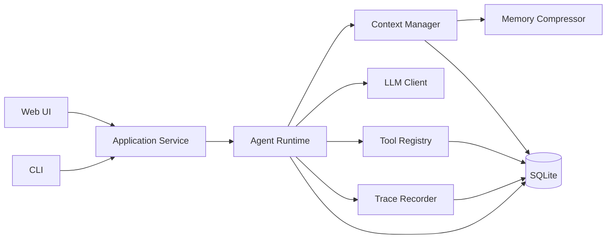

# Minimal Agent Runtime

一个为 Agent 技术笔试从零实现的最小可用 Agent Runtime。它不依赖 LangGraph、
OpenHands、OpenClaw 等 Agent 框架，自行完成模型决策、工具调用、结果回填、循环控制、
多 Session、Context 压缩、Memory 召回和 Trace。

网页采用“Runtime Workbench”视角，把 `INPUT → MODEL → TOOL → CONTINUE` 运行链路直接
展示给面试官；同一套核心 Runtime 也可以从 CLI 调用。

## 功能概览

- OpenAI-compatible 真实 LLM Chat Completions 接入。
- 自研 Agent Loop，支持一个响应中的多个工具调用和多轮工具循环。
- 四个统一注册、带 JSON Schema 的工具：Calculator、Mock Search、Todo、Mock Weather。
- SQLite 持久化 Session、Message、Memory、Todo、Run 和 Trace。
- 多 Session 严格隔离，同一 Session 请求串行、不同 Session 可并发。
- Context 字符预算、近期轮次保留、工具消息原子组和基础摘要压缩。
- LLM、工具、参数、最大轮次和压缩失败的受控异常处理。
- 结构化 Trace、耗时记录、长度限制和敏感信息递归脱敏。
- FastAPI 网页、CLI、74 个离线测试和显式开启的真实 LLM 测试。

## 架构



核心依赖方向为 `Web/CLI → Application → Runtime → Protocols → Adapters`。`runtime.py`
不导入 FastAPI，网页也不保存业务状态。

## Agent Loop

每次用户请求按以下顺序执行：

1. 校验 Session 和用户输入，创建 Run，持久化用户消息。
2. 构建当前 Session 的 Context，必要时先压缩旧历史。
3. 把消息和工具 Schema 发送给真实 LLM。
4. 如果模型返回最终文本，保存回答并结束 Run。
5. 如果模型返回 `tool_calls`，逐个校验名称和参数 Schema，然后执行工具。
6. 把成功结果或受控失败作为 `tool` 消息回填 Context。
7. 进入下一轮，直到模型返回答案、发生不可恢复错误或达到最大轮次。

模型可见的是最终回答、结构化工具调用和工具结果。Trace 不收集、展示或伪造模型隐藏
思维链。

## 快速开始

### 1. 安装

```powershell
python -m venv .venv
.\.venv\Scripts\Activate.ps1
python -m pip install -e ".[dev]"
```

macOS/Linux 激活方式为 `source .venv/bin/activate`。

### 2. 配置真实模型

```powershell
Copy-Item .env.example .env
```

编辑 `.env`：

```dotenv
LLM_BASE_URL=https://api.openai.com/v1
LLM_MODEL=your-tool-capable-model
LLM_API_KEY=your-secret-key
```

目标服务必须兼容 `/chat/completions`，并支持结构化 `tool_calls`。密钥只通过环境进入
Authorization Header；`.env`、数据库和日志已在 `.gitignore` 中排除。

### 3. 启动网页

```powershell
python -m uvicorn app.api.app:create_app --factory --host 127.0.0.1 --port 8000
```

打开 <http://127.0.0.1:8000>。API 文档位于 <http://127.0.0.1:8000/docs>。

> 当前 Session 锁是进程内锁，演示时请保持单进程，不要配置多个 Uvicorn worker。

### 4. 启动 CLI

```powershell
python -m app.cli
```

CLI 命令：`/new`、`/sessions`、`/use <id>`、`/tools`、`/trace`、`/quit`。

## 四个工具

| 工具 | 参数 | 行为 |
| --- | --- | --- |
| `calculator` | `expression: string` | 使用受限 AST 计算基础算术；禁止 `eval`、名称、调用和属性访问 |
| `search` | `query: string`, `limit: 1..5` | 搜索项目内固定语料，结果稳定且不访问互联网 |
| `todo` | `action: add/list`, `content?` | 仅操作 Runtime 注入的当前 Session Todo |
| `weather` | `city: string` | 查询广州、北京、上海、深圳的确定性 Mock 天气数据，便于重复演示 |

`ToolRegistry` 从 Pydantic 参数模型生成 JSON Schema。LLM 返回的 arguments 在 Handler
执行前通过 `model_validate_json(..., strict=True)` 校验；未知工具、JSON 错误、Schema
错误和 Handler 异常都会转换为可回填模型的 `ToolResult`。

## Session 与 SQLite

SQLite 数据库默认为 `data/agent.db`，无需安装数据库服务。主要表包括：

- `sessions`
- `messages`
- `session_memories`
- `todos`
- `agent_runs`
- `trace_events`

所有 Session 级查询都显式携带 `session_id`。Todo 不接受模型传入的 Session ID，只使用
Runtime 注入的 `ToolContext.session_id`。关闭应用后重新启动，历史、Todo、Memory 和
Trace 仍可恢复。

## Context 与 Memory

### 压缩触发时机

每次模型调用前，Context Manager 估算系统指令、工具 Schema、消息和回复预留空间的总
字符预算。当估算值超过 `AGENT_CONTEXT_BUDGET × AGENT_COMPRESSION_THRESHOLD` 时，
较旧的完整对话轮次进入压缩；最近 `AGENT_RECENT_TURNS` 轮保留原文。

### Memory 放在哪里

压缩结果写入当前 Session 的 `session_memories` 表，并保存 `through_message_id` 水位。
它不是跨 Session 用户画像，也不进入其他 Session。

### Memory 何时召回

同一 Session 下一次构建 Context 时，顺序固定为：

```text
System Prompt
→ Session Memory Summary（明确标注为历史摘要，不是新指令）
→ 摘要水位之后的近期完整消息
→ 当前用户输入
```

Assistant tool_call 与对应 tool result 作为不可拆分原子组保留或压缩。摘要模型调用禁用
工具，避免递归进入 Agent Loop；摘要服务失败时使用确定性降级摘要，同时记录
`compression_fallback` Trace。

当前实现采用保守字符估算并留安全余量，不宣称是某家模型的精确 tokenizer。这符合笔试
“基础压缩”范围，也保持供应商兼容性。

## Trace 与错误处理

Trace 至少包含：

- `run_started`
- `context_built`
- `compression_completed` / `compression_fallback`
- `model_started` / `model_completed`
- `tool_started` / `tool_completed`
- `round_completed`
- `run_completed` / `run_failed` / `max_rounds_reached`

Payload 使用字段白名单式记录、字符串长度上限和递归敏感键过滤。`authorization`、
`api_key`、`token`、`cookie`、`password`、`secret` 与 reasoning 类字段会替换为
`[REDACTED]`。

LLM 超时、HTTP 状态、协议错误、未知工具、参数错误、Handler 异常和最大轮次均有稳定
错误结果。一次 Run 失败不会终止服务，也不会影响其他 Session。

## API

| 方法 | 路径 | 用途 |
| --- | --- | --- |
| GET | `/api/health` | 服务、SQLite 和 LLM 配置状态 |
| POST | `/api/sessions` | 创建 Session |
| GET | `/api/sessions` | 列出 Session |
| GET | `/api/sessions/{id}/messages` | 获取历史 |
| POST | `/api/sessions/{id}/runs` | 执行 Agent Run |
| GET | `/api/runs/{id}/trace` | 获取 Trace |
| GET | `/api/tools` | 查看工具 Schema |

MVP 使用非流式 JSON；Run 完成后一次返回最终回答和事件列表，网页按时间线展示。

## 测试

离线测试不访问真实模型：

```powershell
pytest -q -m "not live"
ruff check .
mypy app
python -m compileall app
```

显式运行真实 LLM 测试：

```powershell
$env:RUN_LIVE_LLM_TESTS='1'
pytest tests/e2e/test_live_llm.py -q -m live
```

Live 测试验证直接回答、Calculator 和 Todo 多轮对话，不按模型固定措辞断言。

## 项目结构

```text
app/
  runtime.py          # Agent Loop
  context.py          # Context 预算与选择
  memory.py           # 摘要与降级压缩
  application.py      # 用例与 Session 锁
  tracing.py          # 结构化 Trace 与脱敏
  llm/                # OpenAI-compatible HTTP 适配器
  tools/              # Registry + 四个工具
  storage/            # SQLite Repository
  api/                # FastAPI
  web/                # 原生网页
tests/                # unit / integration / e2e
docs/                 # AI 开发记录与录屏脚本
```

## 已知边界

- 单进程、单机演示，不实现分布式锁和高可用。
- Mock Search 不访问互联网。
- 不实现多 Agent、RAG、向量记忆、复杂规划器或浏览器控制。
- 不使用流式传输；重点放在 Runtime 正确性和可观察性。
- Context 使用基础字符预算，不是供应商级精确 token 计数。

## 笔试提交材料

- 代码仓库链接。
- Web 或 CLI 完整操作录屏。
- 本 README。
- [`submission/README.md`](submission/README.md)：可直接填写的提交信息与最终检查入口。
- [`submission/AI-Prompt与问题解决记录.md`](submission/AI-Prompt与问题解决记录.md)。
- [`docs/ai-development-log.md`](docs/ai-development-log.md)。
- [`docs/acceptance-report.md`](docs/acceptance-report.md)。
- [`docs/demo-script.md`](docs/demo-script.md)。
